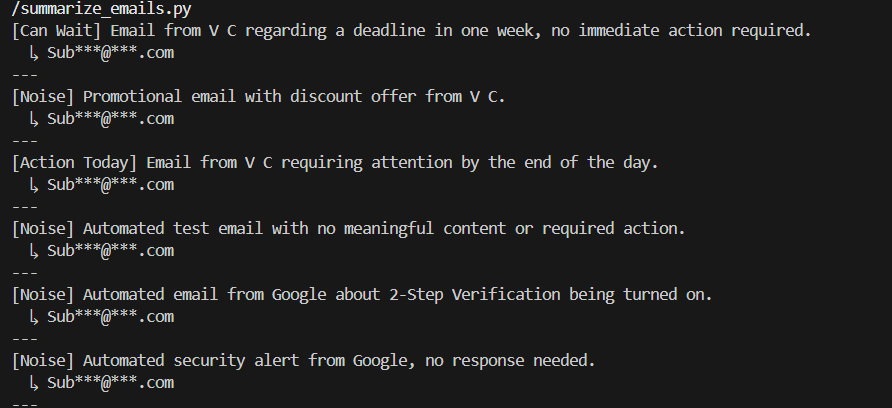

# Priority Inbox — AI Email Triage System.

An AI-powered email categorization tool that connects Gmail and Groq LLM to automatically triage emails into three categories: Action Today, Can Wait, and Noise.

## Demo

## Tech Stack
- Python
- Gmail API (OAuth Authentication)
- Groq API (Llama LLM)
- python-dotenv (.env security)
- Git / GitHub

## What It Does
- Authenticates with real Gmail account using OAuth
- Fetches live emails (subject + sender)
- Sends emails to Groq LLM with a custom prompt
- Categorizes each email as Action Today / Can Wait / Noise
- Secured API credentials using .env best practices

## How to Run
1. Clone the repo
2. Create virtual environment and activate it
3. Install dependencies: `pip install -r requirements.txt`
4. Add your API keys to `.env` file
5. Run `summarize_emails.py`

## Key Learning
Built end-to-end API authentication, LLM prompt engineering, and secure credential management.
